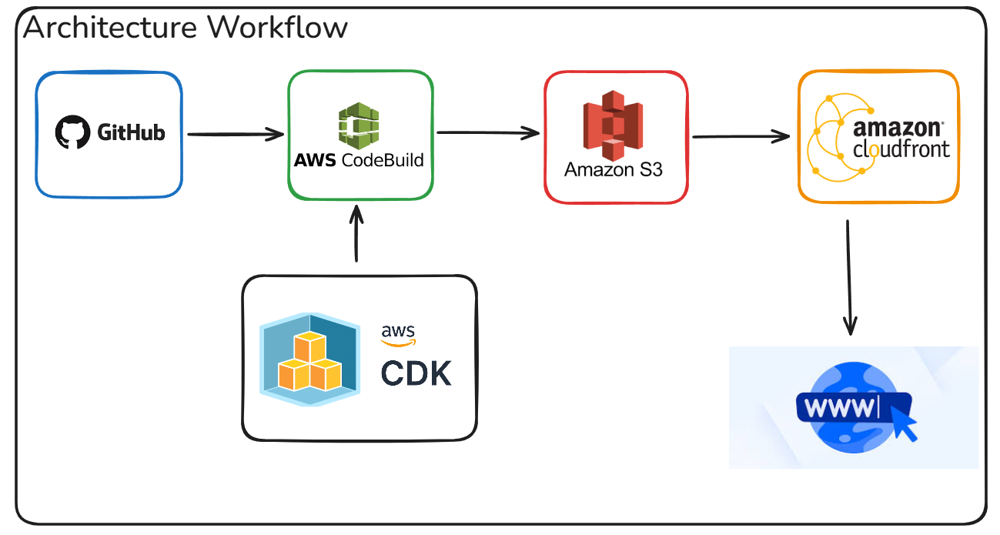

# 🌐 Yousif Alani's Cloud Portfolio

A modern, responsive, and serverless personal portfolio website built using **Next.js**, **TypeScript**, and deployed on **AWS** using **CloudFront**, **S3**, and **CodeBuild** with a fully automated CI/CD pipeline.

This project showcases my cloud engineering skills, full-stack development knowledge, and infrastructure-as-code capabilities. It's more than just a website, it's an end-to-end cloud-native solution demonstrating modern DevOps practices.

## 🚀 Live Website

**[Visit Portfolio](https://dgpwnn5lpbu0j.cloudfront.net/)** - Deployed using AWS CodeBuild, S3, CloudFront, and GitHub-integrated CI/CD.

## 🔧 Technologies Used

### 🧑‍💻 Frontend

-   **Next.js 15** (App Router with static export)
-   **React 18** with modern hooks
-   **TypeScript** for type safety
-   **CSS-in-JS** with styled-jsx for component styling
-   **Inter Font** from Google Fonts
-   **Responsive Design** with mobile-first approach

### ☁️ Cloud Infrastructure

-   **AWS S3** – Static website hosting with public access
-   **AWS CloudFront** – Global CDN for low-latency delivery
-   **AWS CodeBuild** – Automated builds triggered by GitHub pushes
-   **AWS IAM** – Secure access and least-privilege permissions
-   **AWS CDK** (TypeScript) – Infrastructure as Code
-   **GitHub Integration** – Source control with automated deployments

## 🏗️ Architecture Overview





This diagram illustrates the end-to-end deployment pipeline:

1.  **GitHub Repository** — Source code for the portfolio website.
    
2.  **AWS CodeBuild** — Automates the build process (Next.js export) and deploys artifacts.
    
3.  **Amazon S3** — Hosts the static site generated from the build process.
    
4.  **Amazon CloudFront** — Serves the website globally with caching, HTTPS, and CDN performance.
    
5.  **AWS CDK** — Infrastructure as Code (IaC) used to provision and manage all AWS resources.

## 🛠️ Project Structure

```
Portfolio/
├── portfolio/                  # Frontend Next.js application
│   ├── public/                # Static assets (favicon, images, resume)
│   │   ├── pfp2.jpg          # Profile picture
│   │   ├── Resume.pdf        # Resume file
│   │   └── favicon.ico       # Site favicon
│   ├── src/                  # Application source code
│   │   └── app/              # Next.js App Router
│   │       ├── layout.tsx    # Root layout component
│   │       ├── page.tsx      # Main portfolio page
│   │       └── globals.css   # Global styles
│   ├── package.json          # Dependencies and scripts
│   ├── next.config.js        # Next.js configuration
│   └── tsconfig.json         # TypeScript configuration
├── infra/                    # AWS CDK Infrastructure
│   ├── lib/                  # CDK stack definitions
│   │   └── portfolio-stack.ts # Main infrastructure stack
│   ├── bin/                  # CDK app entry point
│   ├── package.json          # CDK dependencies
│   └── cdk.json              # CDK configuration
├── buildspec.yml             # CodeBuild pipeline definition
└── README.md                 # Project documentation
```

## ⚙️ How It Works

### 1. **Code Commit to GitHub**

-   Push to main branch triggers GitHub webhook
-   CodeBuild automatically starts the build process

### 2. **CodeBuild Pipeline Phases**

yaml

```yaml
phases:
  install:
    runtime-versions:
      nodejs: 18
  pre_build:
    commands:
      - cd portfolio
      - npm install
  build:
    commands:
      - npm run build
  post_build:
    commands:
      - aws s3 sync out/ s3://$S3_BUCKET --delete
      - aws cloudfront create-invalidation --distribution-id $CLOUDFRONT_ID --paths "/*"
```

### 3. **S3 + CloudFront Deployment**

-   Static files uploaded to S3 bucket
-   CloudFront serves content globally with edge caching
-   Cache invalidation ensures latest version is served immediately

### 4. **Infrastructure as Code**

-   Complete AWS infrastructure defined in TypeScript using CDK
-   Reproducible and version-controlled infrastructure
-   Automated resource provisioning and configuration

## 🎨 Features

### ✨ Modern UI/UX

-   **Responsive Design** - Optimized for all devices
-   **Dark Theme** - Professional dark mode design
-   **Smooth Animations** - CSS keyframe animations and transitions
-   **Glassmorphism Effects** - Modern backdrop blur and transparency
-   **Interactive Elements** - Hover effects and micro-interactions

### 🔒 Security & Performance

-   **HTTPS Everywhere** - SSL/TLS encryption via CloudFront
-   **Global CDN** - Fast loading times worldwide
-   **Optimized Images** - Next.js Image component with optimization
-   **Static Generation** - Pre-built pages for maximum performance
-   **Security Headers** - Proper CORS and security configurations

### 📱 Sections

-   **Hero Section** - Professional profile with animated elements
-   **About Me** - Personal background and technical interests
-   **Projects** - Detailed showcase of cloud engineering projects
-   **Certifications** - Current and pursuing technical certifications
-   **Contact** - Multiple ways to connect (Email, LinkedIn, GitHub, Resume)

## 🧠 What I Learned

### Cloud Engineering

-   Designing and implementing serverless architectures
-   Managing AWS resources using Infrastructure as Code
-   Setting up automated CI/CD pipelines with AWS CodeBuild
-   Configuring CloudFront distributions for optimal performance
-   Implementing secure S3 bucket policies and IAM roles

### Full-Stack Development

-   Building modern React applications with Next.js 15
-   Implementing responsive design with CSS-in-JS
-   Optimizing web applications for performance and SEO
-   Managing build processes and static site generation
-   Integrating third-party services and APIs

### DevOps Practices

-   Version controlling infrastructure alongside application code
-   Automating deployment workflows with GitHub integration
-   Implementing proper environment management and configuration
-   Monitoring and maintaining cloud resources
-   Following security best practices for web applications

## 💡 Future Improvements

### 🏗️ Infrastructure

-   **Monitoring & Alerting** - CloudWatch alarms and SNS notifications
-   **Backup Strategy** - Automated backups and disaster recovery
-   **Cost Optimization** - Resource usage monitoring and optimization


## 🌟 Final Thoughts

This portfolio isn’t just a static website, it’s a cloud-native, full-stack application that reflects my passion for **cloud engineering**, **DevOps**, and **modern web development**. I built it not only to showcase my work, but to prove I can design, build, and deploy production-grade infrastructure and applications.

As I continue learning and building, this site will evolve with new features, certifications, and projects. If you’re a recruiter, engineer, or just curious, feel free to explore and connect!